# JigsawKit Product Architecture Specification

## Table of Contents

- [1. Product Vision](#1-product-vision)
- [2. Target Users](#2-target-users)
- [3. Core Product Principles](#3-core-product-principles)
- [4. Architecture Diagrams and Product Flow Visuals](#4-architecture-diagrams-and-product-flow-visuals)
- [5. Product Scope](#5-product-scope)
- [6. Recommended Tech Stack](#6-recommended-tech-stack)
- [7. Monorepo Structure](#7-monorepo-structure)
- [8. Core System Architecture](#8-core-system-architecture)
- [9. Data Model](#9-data-model)
- [10. Prisma Schema Draft](#10-prisma-schema-draft)
- [11. API Design](#11-api-design)
- [11.1 API Surfaces](#111-api-surfaces)
- [11.2 Public API Endpoints](#112-public-api-endpoints)
- [11.3 Dashboard API Endpoints](#113-dashboard-api-endpoints)
- [12. SDK Architecture](#12-sdk-architecture)
- [12.1 SDK Goals](#121-sdk-goals)
- [12.2 SDK Package](#122-sdk-package)
- [12.3 SDK Initialization](#123-sdk-initialization)
- [12.4 Identity](#124-identity)
- [12.5 Asking for Feedback](#125-asking-for-feedback)
- [12.6 Widget Behavior](#126-widget-behavior)
- [12.7 Feedback Prompt UX](#127-feedback-prompt-ux)
- [12.8 SDK Resilience](#128-sdk-resilience)
- [12.9 SDK Rate Limiting Client-Side](#129-sdk-rate-limiting-client-side)
- [12.10 SDK Event Queue](#1210-sdk-event-queue)
- [12.11 React SDK](#1211-react-sdk)
- [13. Frontend Dashboard Architecture](#13-frontend-dashboard-architecture)
- [13.1 Main Dashboard Pages](#131-main-dashboard-pages)
- [13.2 Dashboard Navigation](#132-dashboard-navigation)
- [13.3 Feedback Inbox](#133-feedback-inbox)
- [13.4 Feedback Detail View](#134-feedback-detail-view)
- [13.5 Analytics Page](#135-analytics-page)
- [13.6 Prompts Page](#136-prompts-page)
- [13.7 Project Settings](#137-project-settings)
- [14. Backend Architecture](#14-backend-architecture)
- [14.1 Backend Layers](#141-backend-layers)
- [14.2 Example Backend Folder Structure](#142-example-backend-folder-structure)
- [14.3 Validation Strategy](#143-validation-strategy)
- [14.4 Error Format](#144-error-format)
- [15. Authentication and Authorization](#15-authentication-and-authorization)
- [15.1 Dashboard Auth](#151-dashboard-auth)
- [15.2 Public SDK Auth](#152-public-sdk-auth)
- [15.3 RBAC](#153-rbac)
- [16. Security Requirements](#16-security-requirements)
- [16.1 Origin Restrictions](#161-origin-restrictions)
- [16.2 API Key Security](#162-api-key-security)
- [16.3 Rate Limiting](#163-rate-limiting)
- [16.4 Spam Prevention](#164-spam-prevention)
- [16.5 Privacy](#165-privacy)
- [16.6 Data Retention](#166-data-retention)
- [17. Widget Design](#17-widget-design)
- [17.1 Visual Style](#171-visual-style)
- [17.2 Widget Placement](#172-widget-placement)
- [17.3 Widget States](#173-widget-states)
- [17.4 User Flow](#174-user-flow)
- [17.5 Accessibility](#175-accessibility)
- [18. Feedback Prompt Types](#18-feedback-prompt-types)
- [18.1 Thumbs](#181-thumbs)
- [18.2 Emoji](#182-emoji)
- [18.3 Rating](#183-rating)
- [18.4 Multiple Choice](#184-multiple-choice)
- [18.5 Text](#185-text)
- [18.6 Bug](#186-bug)
- [18.7 NPS](#187-nps)
- [19. Targeting Rules](#19-targeting-rules)
- [20. Integrations](#20-integrations)
- [20.1 MVP Integration Priority](#201-mvp-integration-priority)
- [20.2 Slack](#202-slack)
- [20.3 GitHub Issues](#203-github-issues)
- [Feedback](#feedback)
- [Context](#context)
- [20.4 Linear](#204-linear)
- [20.5 Webhooks](#205-webhooks)
- [21. Analytics and Intelligence](#21-analytics-and-intelligence)
- [21.1 MVP Analytics](#211-mvp-analytics)
- [21.2 Later AI Features](#212-later-ai-features)
- [21.3 Feedback Clustering](#213-feedback-clustering)
- [22. Development Phases](#22-development-phases)
- [Phase 0: Foundation](#phase-0-foundation)
- [Phase 1: Auth and Project Setup](#phase-1-auth-and-project-setup)
- [Phase 2: Public Feedback Ingestion](#phase-2-public-feedback-ingestion)
- [Phase 3: Browser SDK](#phase-3-browser-sdk)
- [Phase 4: Dashboard Feedback Inbox](#phase-4-dashboard-feedback-inbox)
- [Phase 5: Prompt Management](#phase-5-prompt-management)
- [Phase 6: Analytics](#phase-6-analytics)
- [Phase 7: Integrations](#phase-7-integrations)
- [Phase 8: Intelligence](#phase-8-intelligence)
- [23. MVP User Stories](#23-mvp-user-stories)
- [23.1 Developer Installs SDK](#231-developer-installs-sdk)
- [23.2 Developer Asks Contextual Question](#232-developer-asks-contextual-question)
- [23.3 User Submits Feedback](#233-user-submits-feedback)
- [23.4 Founder Reviews Feedback](#234-founder-reviews-feedback)
- [23.5 Team Routes Feedback](#235-team-routes-feedback)
- [24. Testing Strategy](#24-testing-strategy)
- [24.1 Backend Tests](#241-backend-tests)
- [24.2 SDK Tests](#242-sdk-tests)
- [24.3 Frontend Tests](#243-frontend-tests)
- [24.4 E2E Tests](#244-e2e-tests)
- [25. Local Development](#25-local-development)
- [25.1 Required Services](#251-required-services)
- [25.2 Environment Variables](#252-environment-variables)
- [26. Environment Separation](#26-environment-separation)
- [27. Observability](#27-observability)
- [27.1 Logging](#271-logging)
- [27.2 Metrics](#272-metrics)
- [27.3 Internal Admin](#273-internal-admin)
- [28. Pricing Model](#28-pricing-model)
- [29. Product Differentiation](#29-product-differentiation)
- [30. Brand and Naming](#30-brand-and-naming)
- [31. Landing Page Structure](#31-landing-page-structure)
- [32. Documentation Structure](#32-documentation-structure)
- [33. Example Use Cases](#33-example-use-cases)
- [33.1 SaaS Onboarding](#331-saas-onboarding)
- [33.2 Checkout Failure](#332-checkout-failure)
- [33.3 File Upload Failure](#333-file-upload-failure)
- [33.4 Education App Lesson](#334-education-app-lesson)
- [33.5 AI App Response](#335-ai-app-response)
- [34. Engineering Standards](#34-engineering-standards)
- [34.1 TypeScript](#341-typescript)
- [34.2 API Design](#342-api-design)
- [34.3 Database](#343-database)
- [34.4 UI](#344-ui)
- [34.5 SDK](#345-sdk)
- [35. Initial Implementation Order](#35-initial-implementation-order)
- [36. MVP Definition of Done](#36-mvp-definition-of-done)
- [37. Important Non-Goals for MVP](#37-important-non-goals-for-mvp)
- [38. Strategic Wedge](#38-strategic-wedge)
- [39. Long-Term Vision](#39-long-term-vision)
- [40. Final Product Summary](#40-final-product-summary)

---

## 1. Product Vision

JigsawKit is feedback infrastructure for modern applications. It gives developers a simple SDK to collect contextual, lightweight, standardized user feedback inside their apps, then routes that feedback into a dashboard, analytics layer, integrations, and product workflows.

The goal is not to build another survey tool, feature board, or bug widget. The goal is to create a universal feedback layer that developers can embed into any web application with minimal setup.

The product should feel like Stripe for feedback:

- Easy to install
- Developer-first
- Clean API design
- Secure by default
- Useful immediately
- Scalable into a larger platform
- Opinionated but flexible
- Beautiful user-facing components
- Strong dashboard for teams

Core product thesis:

> Every app needs feedback, but most teams collect it through scattered emails, support tickets, Discord messages, surveys, hacked-together buttons, and random user complaints. JigsawKit standardizes feedback collection by letting apps ask the right question at the right moment and convert responses into structured product signal.

## 2. Target Users

### 2.1 Primary Users

The first users are developers, founders, and small product teams building web applications.

Examples:

- SaaS dashboards
- AI applications
- developer tools
- education platforms
- finance apps
- creator tools
- marketplace platforms
- internal tools
- productivity apps

### 2.2 Buyer Persona

The likely buyer is:

- a technical founder
- an early-stage startup team
- a product engineer
- a product manager at a small or mid-sized company
- a developer building a user-facing app

### 2.3 End User

The end user is the person inside the customer’s application who sees a feedback prompt.

The end-user experience must be:

- fast
- optional
- non-annoying
- contextual
- respectful
- lightweight
- rewarding when possible

The end user should never feel trapped in a survey.

## 3. Core Product Principles

### 3.1 Feedback Should Be Contextual

JigsawKit should ask for feedback only when the user just experienced something meaningful.

Bad:

> “Please give us feedback.”

Good:

> “Was checkout easy?”

Better:

> Asked only after the user successfully completes checkout or abandons checkout.

### 3.2 Feedback Should Start Small

The first interaction should require almost no effort.

Good input types:

- thumbs up/down
- emoji rating
- one-click choice
- short multiple choice
- optional text after initial response

Avoid starting with:

- long forms
- required text boxes
- 10-question surveys
- confusing rating scales

### 3.3 Feedback Should Be Structured

Every feedback response should have consistent metadata.

A feedback response should include:

- project ID
- environment
- user ID if available
- anonymous visitor ID if user is not identified
- session ID
- event name
- surface/page
- feedback type
- rating or selected option
- optional text
- timestamp
- URL
- browser/device metadata
- custom metadata
- SDK version

### 3.4 Feedback Should Be Actionable

Feedback should not just sit in a database.

The dashboard should help teams:

- see recent feedback
- filter by event, page, user segment, sentiment, and status
- identify repeated issues
- convert feedback into tasks
- assign ownership
- export to Slack, GitHub, Linear, Notion, etc.
- notify users when issues are resolved

### 3.5 Developer Experience Is the Product

The SDK and API should be extremely clean.

Example:

```ts
jigsawkit.init({
  projectKey: "pk_live_abc123"
})

jigsawkit.identify("user_123", {
  email: "user@example.com",
  plan: "pro"
})

jigsawkit.ask({
  event: "checkout_failed",
  question: "What stopped you?",
  choices: ["Payment failed", "Too expensive", "Confusing", "Other"],
  allowText: true
})
```


## 4. Architecture Diagrams and Product Flow Visuals

This section gives the coding session a visual map of how JigsawKit should work across the frontend, backend, SDK, database, and integrations. These diagrams use Mermaid syntax so they can render directly in GitHub, many Markdown editors, and some documentation tools.

### 4.1 Full System Architecture

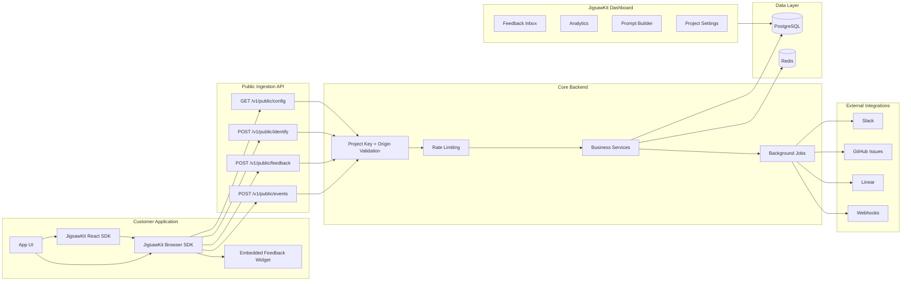

### 4.2 Core Feedback Loop

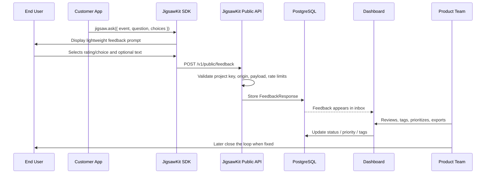

### 4.3 Developer Installation Flow

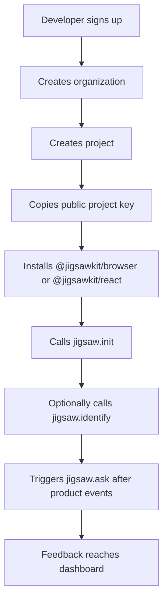

### 4.4 End-User Widget State Machine

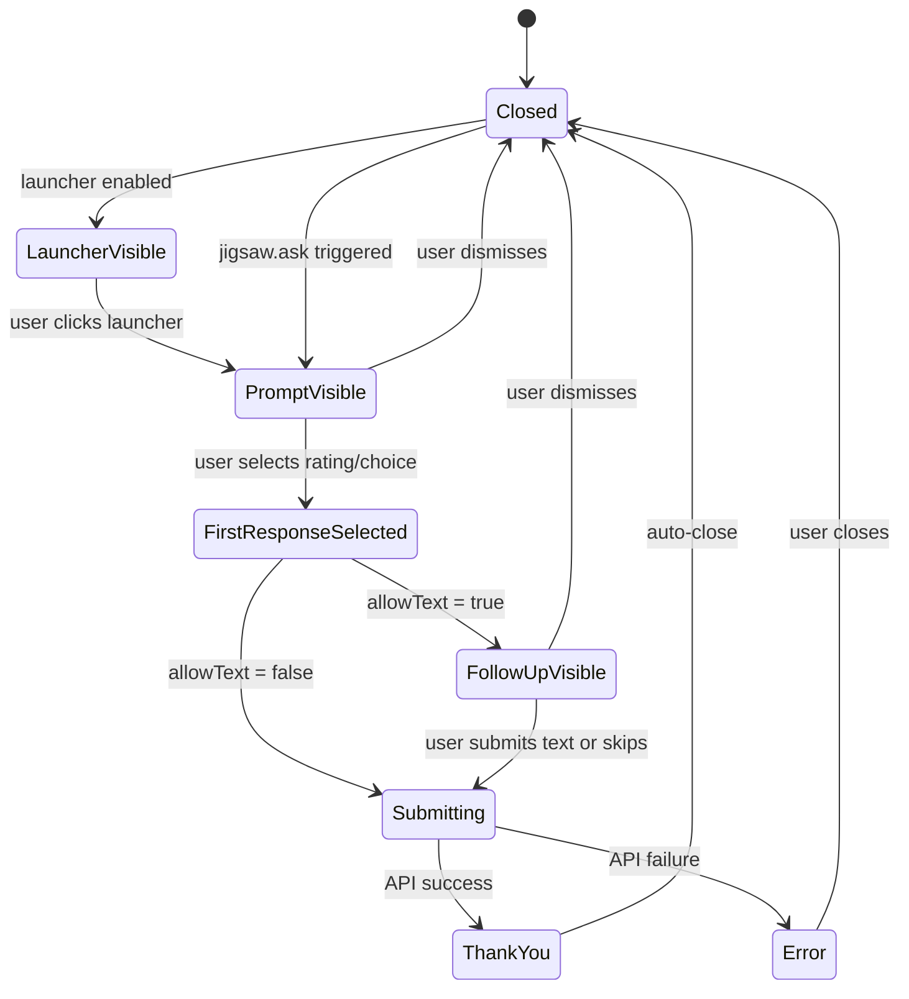

### 4.5 Data Model Relationship Diagram

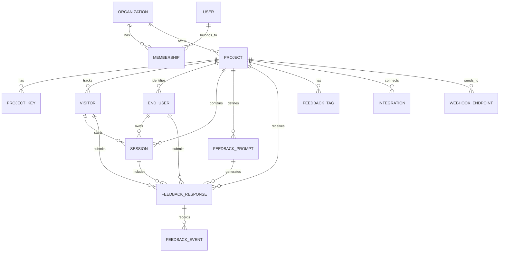

### 4.6 Backend Request Lifecycle

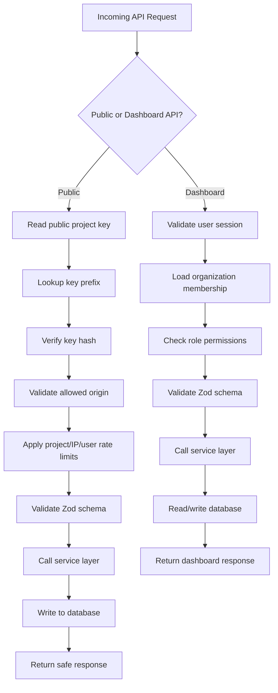

### 4.7 SDK Internal Architecture

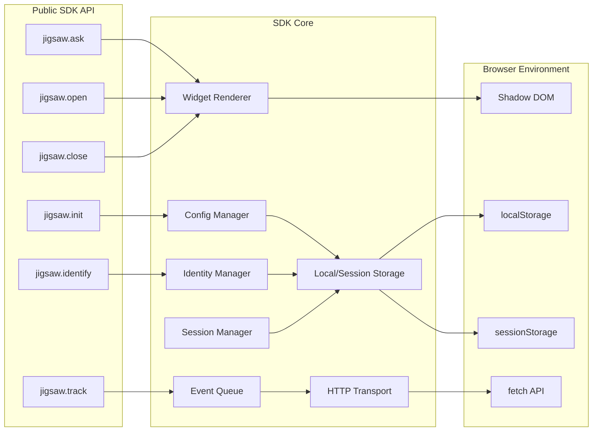

### 4.8 Dashboard Information Architecture

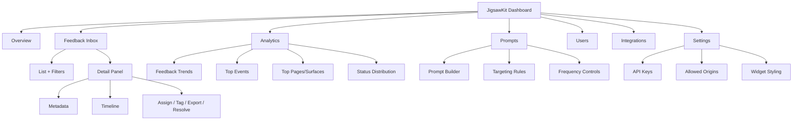

### 4.9 Feedback Object Lifecycle

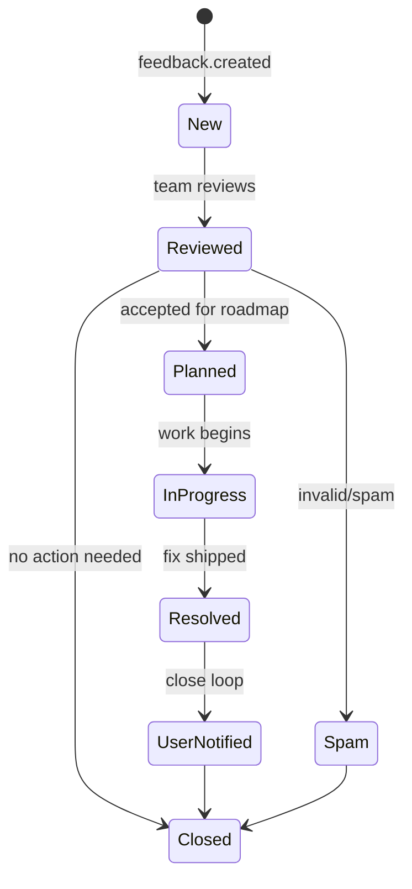

### 4.10 Integration Routing Flow

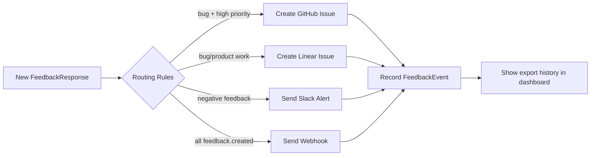

### 4.11 Suggested MVP Build Dependency Graph

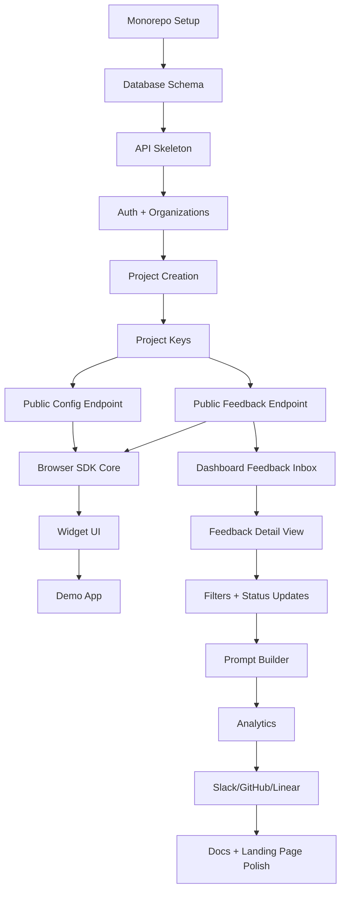

### 4.12 Product Positioning Map

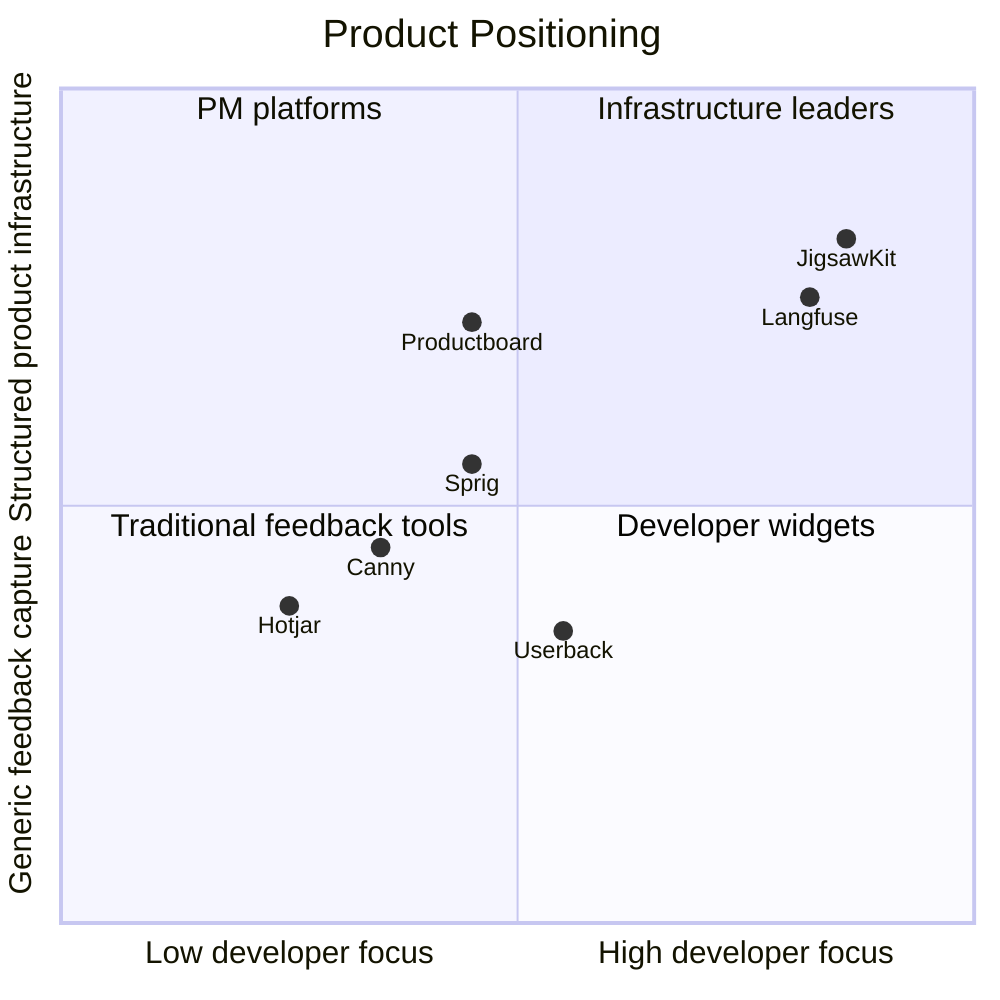

### 4.13 Feedback Data Pipeline

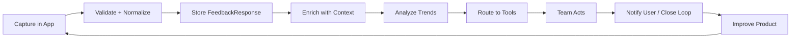

## 5. Product Scope

### 5.1 MVP Scope

The MVP should include:

- marketing landing page
- authentication
- project creation
- public project key
- private API key
- JavaScript/TypeScript SDK
- React SDK wrapper
- feedback widget
- event-triggered feedback prompts
- feedback submission API
- dashboard feedback inbox
- feedback detail view
- basic filters
- basic analytics
- project settings
- widget customization
- team/account model
- rate limiting
- basic spam protection
- local development demo app

### 5.2 Post-MVP Scope

After MVP:

- Slack integration
- GitHub issue creation
- Linear issue creation
- webhook destinations
- AI clustering and summarization
- changelog/close-the-loop notifications
- public feedback portal
- user segmentation
- advanced targeting rules
- screenshots and visual bug capture
- session replay integrations
- mobile SDKs
- enterprise roles and permissions
- SOC2-ready audit logs

## 6. Recommended Tech Stack

### 6.1 Frontend Dashboard

Use:

- Next.js
- TypeScript
- Tailwind CSS
- shadcn/ui
- TanStack Query
- Zod
- React Hook Form
- Recharts

Rationale:

- Next.js gives full-stack flexibility.
- TypeScript improves SDK and API correctness.
- Tailwind + shadcn gives fast, polished UI.
- TanStack Query is excellent for dashboard data fetching.
- Zod keeps validation consistent.
- Recharts is enough for MVP analytics.

### 6.2 Backend

Use:

- Node.js
- TypeScript
- Next.js API routes or standalone Fastify/NestJS backend
- Prisma ORM
- PostgreSQL
- Redis
- BullMQ or background jobs later

For a serious scalable architecture, prefer a separate backend service:

- `apps/web`: Next.js dashboard and marketing site
- `apps/api`: Fastify API service
- `packages/sdk`: browser SDK
- `packages/react`: React bindings
- `packages/db`: Prisma schema/client
- `packages/shared`: shared types and validation schemas

This keeps the product clean and modular.

### 6.3 Database

Use PostgreSQL.

PostgreSQL is ideal because the data is relational but also needs flexible JSON metadata.

Use JSONB for:

- user traits
- feedback metadata
- browser metadata
- targeting rules
- widget settings
- custom fields

### 6.4 Cache / Queue

Use Redis later for:

- rate limiting
- job queues
- event buffering
- deduplication
- webhook retries
- background analytics processing

### 6.5 Deployment

MVP deployment options:

- Vercel for frontend
- Railway/Fly.io/Render for API and Postgres
- Supabase for hosted Postgres
- Upstash Redis for Redis

Long-term:

- AWS ECS/Fargate or Kubernetes
- RDS Postgres
- Elasticache Redis
- S3-compatible object storage
- Cloudflare CDN

## 7. Monorepo Structure

Use a monorepo.

Recommended structure:

```txt
jigsawkit/
  apps/
    web/
    api/
    demo/
  packages/
    sdk/
    react/
    db/
    shared/
    ui/
    config/
  docs/
    architecture.md
    api.md
    sdk.md
    database.md
    security.md
  prisma/
    schema.prisma
  package.json
  pnpm-workspace.yaml
  turbo.json
  README.md
```

### 7.1 apps/web

Contains:

- landing page
- auth pages
- dashboard
- project settings
- feedback inbox
- analytics pages
- billing later

### 7.2 apps/api

Contains:

- public ingestion API
- private dashboard API
- auth-protected project APIs
- admin/team APIs
- webhook APIs later

### 7.3 apps/demo

Contains a demo application showing how JigsawKit works.

The demo app should simulate:

- onboarding flow
- checkout flow
- AI response flow
- file upload flow
- error flow
- success flow

### 7.4 packages/sdk

The vanilla browser SDK.

Exports:

```ts
init
identify
track
ask
open
close
submit
configure
```

### 7.5 packages/react

React wrapper package.

Exports:

```ts
JigsawKitProvider
useJigsawKit
FeedbackButton
FeedbackPrompt
```

### 7.6 packages/db

Prisma schema and database client.

### 7.7 packages/shared

Shared TypeScript types and Zod schemas.

### 7.8 packages/ui

Reusable internal UI components.

## 8. Core System Architecture

### 8.1 High-Level Flow

1. Customer installs SDK.
2. Customer initializes SDK with public project key.
3. SDK creates or retrieves anonymous visitor ID.
4. Customer optionally calls `identify`.
5. Customer triggers `ask` after a meaningful product event.
6. SDK displays a feedback prompt.
7. User submits lightweight feedback.
8. SDK sends feedback to public ingestion API.
9. API validates project key, origin, payload, and rate limits.
10. Feedback is stored in Postgres.
11. Dashboard displays feedback in inbox.
12. Team reviews, tags, assigns, exports, or resolves feedback.
13. Later, user can be notified when action is taken.

### 8.2 System Components

| Component | Responsibility |
|---|---|
| Browser SDK | Display prompt, collect response, attach context |
| React SDK | Make SDK easy to use in React apps |
| Public API | Receive feedback from customer apps |
| Dashboard API | Serve project/team data |
| Database | Persist feedback and configuration |
| Dashboard UI | Review and manage feedback |
| Analytics layer | Aggregate feedback trends |
| Integrations layer | Send feedback to external tools |
| Job queue | Process summaries, webhooks, notifications |

## 9. Data Model

### 9.1 Entities

Core entities:

- Organization
- User
- Membership
- Project
- ProjectKey
- Visitor
- EndUser
- Session
- FeedbackPrompt
- FeedbackResponse
- FeedbackTag
- FeedbackAssignment
- FeedbackEvent
- Integration
- WebhookEndpoint
- AuditLog

### 9.2 Organization

An organization owns projects and team members.

Fields:

```txt
id
name
slug
createdAt
updatedAt
```

### 9.3 User

A dashboard user.

Fields:

```txt
id
email
name
imageUrl
createdAt
updatedAt
```

### 9.4 Membership

Connects dashboard users to organizations.

Fields:

```txt
id
organizationId
userId
role
createdAt
updatedAt
```

Roles:

```txt
owner
admin
member
viewer
```

### 9.5 Project

A customer application using JigsawKit.

Fields:

```txt
id
organizationId
name
slug
environment
allowedOrigins
widgetSettings
createdAt
updatedAt
```

Environment can be:

```txt
development
staging
production
```

### 9.6 ProjectKey

Stores public and secret keys.

Fields:

```txt
id
projectId
type
prefix
hashedKey
lastUsedAt
createdAt
revokedAt
```

Key types:

```txt
public
secret
```

Public keys are used in frontend SDKs. Secret keys are used for server-side integrations.

Never store raw private keys. Store only hashed keys.

### 9.7 Visitor

Represents an anonymous browser/device visitor.

Fields:

```txt
id
projectId
anonymousId
firstSeenAt
lastSeenAt
metadata
```

### 9.8 EndUser

Represents an identified user inside the customer’s app.

Fields:

```txt
id
projectId
externalUserId
email
name
traits
createdAt
updatedAt
lastSeenAt
```

Important:

`externalUserId` is the ID from the customer’s system.

### 9.9 Session

Represents a user session.

Fields:

```txt
id
projectId
visitorId
endUserId
sessionToken
startedAt
endedAt
metadata
```

### 9.10 FeedbackPrompt

A configured or dynamically-created prompt.

Fields:

```txt
id
projectId
key
name
question
description
type
choices
settings
targetingRules
createdAt
updatedAt
archivedAt
```

Prompt types:

```txt
thumbs
emoji
rating
multiple_choice
text
bug
nps
custom
```

### 9.11 FeedbackResponse

The core feedback object.

Fields:

```txt
id
projectId
promptId
visitorId
endUserId
sessionId
eventName
surface
url
path
title
type
rating
choice
choices
text
sentiment
status
priority
metadata
browser
device
sdk
createdAt
updatedAt
```

Statuses:

```txt
new
reviewed
planned
in_progress
resolved
closed
spam
```

Priorities:

```txt
low
medium
high
urgent
```

### 9.12 FeedbackTag

Tags applied to feedback.

Fields:

```txt
id
projectId
name
color
createdAt
updatedAt
```

Default tags:

```txt
bug
confusion
feature_request
praise
churn_risk
pricing
performance
ux
content
other
```

### 9.13 FeedbackAssignment

Assigns feedback to a team member.

Fields:

```txt
id
feedbackResponseId
userId
createdAt
```

### 9.14 FeedbackEvent

Tracks lifecycle events for feedback.

Fields:

```txt
id
feedbackResponseId
actorUserId
type
payload
createdAt
```

Event types:

```txt
created
tagged
assigned
status_changed
priority_changed
exported
commented
resolved
notified_user
```

### 9.15 Integration

Represents connected tools.

Fields:

```txt
id
projectId
type
status
config
createdAt
updatedAt
```

Integration types:

```txt
slack
github
linear
notion
productboard
canny
webhook
```

### 9.16 WebhookEndpoint

Fields:

```txt
id
projectId
url
secret
enabled
events
createdAt
updatedAt
```

### 9.17 AuditLog

Fields:

```txt
id
organizationId
projectId
actorUserId
action
resourceType
resourceId
metadata
createdAt
```

## 10. Prisma Schema Draft

```prisma
model Organization {
  id          String       @id @default(cuid())
  name        String
  slug        String       @unique
  users       Membership[]
  projects    Project[]
  createdAt   DateTime     @default(now())
  updatedAt   DateTime     @updatedAt
}

model User {
  id          String       @id @default(cuid())
  email       String       @unique
  name        String?
  imageUrl    String?
  memberships Membership[]
  createdAt   DateTime     @default(now())
  updatedAt   DateTime     @updatedAt
}

model Membership {
  id             String       @id @default(cuid())
  organizationId String
  userId         String
  role           String
  organization   Organization @relation(fields: [organizationId], references: [id])
  user           User         @relation(fields: [userId], references: [id])
  createdAt      DateTime     @default(now())
  updatedAt      DateTime     @updatedAt

  @@unique([organizationId, userId])
}

model Project {
  id              String             @id @default(cuid())
  organizationId  String
  name            String
  slug            String
  environment     String             @default("production")
  allowedOrigins  String[]
  widgetSettings  Json?
  organization    Organization       @relation(fields: [organizationId], references: [id])
  keys            ProjectKey[]
  visitors        Visitor[]
  endUsers        EndUser[]
  sessions        Session[]
  prompts         FeedbackPrompt[]
  responses       FeedbackResponse[]
  tags            FeedbackTag[]
  integrations    Integration[]
  webhooks        WebhookEndpoint[]
  createdAt       DateTime           @default(now())
  updatedAt       DateTime           @updatedAt

  @@unique([organizationId, slug])
}

model ProjectKey {
  id          String    @id @default(cuid())
  projectId   String
  type        String
  prefix      String
  hashedKey   String
  lastUsedAt  DateTime?
  revokedAt   DateTime?
  project     Project   @relation(fields: [projectId], references: [id])
  createdAt   DateTime  @default(now())

  @@index([prefix])
}

model Visitor {
  id          String             @id @default(cuid())
  projectId   String
  anonymousId String
  metadata    Json?
  project     Project            @relation(fields: [projectId], references: [id])
  sessions    Session[]
  responses   FeedbackResponse[]
  firstSeenAt DateTime           @default(now())
  lastSeenAt  DateTime           @default(now())

  @@unique([projectId, anonymousId])
}

model EndUser {
  id             String             @id @default(cuid())
  projectId      String
  externalUserId String
  email          String?
  name           String?
  traits         Json?
  project        Project            @relation(fields: [projectId], references: [id])
  sessions       Session[]
  responses      FeedbackResponse[]
  createdAt      DateTime           @default(now())
  updatedAt      DateTime           @updatedAt
  lastSeenAt     DateTime           @default(now())

  @@unique([projectId, externalUserId])
}

model Session {
  id           String             @id @default(cuid())
  projectId    String
  visitorId    String?
  endUserId    String?
  sessionToken String
  metadata     Json?
  project      Project            @relation(fields: [projectId], references: [id])
  visitor      Visitor?           @relation(fields: [visitorId], references: [id])
  endUser      EndUser?           @relation(fields: [endUserId], references: [id])
  responses    FeedbackResponse[]
  startedAt    DateTime           @default(now())
  endedAt      DateTime?

  @@unique([projectId, sessionToken])
}

model FeedbackPrompt {
  id             String             @id @default(cuid())
  projectId      String
  key            String
  name           String
  question       String
  description    String?
  type           String
  choices        Json?
  settings       Json?
  targetingRules Json?
  project        Project            @relation(fields: [projectId], references: [id])
  responses      FeedbackResponse[]
  createdAt      DateTime           @default(now())
  updatedAt      DateTime           @updatedAt
  archivedAt     DateTime?

  @@unique([projectId, key])
}

model FeedbackResponse {
  id          String          @id @default(cuid())
  projectId   String
  promptId    String?
  visitorId   String?
  endUserId   String?
  sessionId   String?
  eventName   String?
  surface     String?
  url         String?
  path        String?
  title       String?
  type        String
  rating      Int?
  choice      String?
  choices     Json?
  text        String?
  sentiment   String?
  status      String          @default("new")
  priority    String          @default("medium")
  metadata    Json?
  browser     Json?
  device      Json?
  sdk         Json?
  project     Project         @relation(fields: [projectId], references: [id])
  prompt      FeedbackPrompt? @relation(fields: [promptId], references: [id])
  visitor     Visitor?        @relation(fields: [visitorId], references: [id])
  endUser     EndUser?        @relation(fields: [endUserId], references: [id])
  session     Session?        @relation(fields: [sessionId], references: [id])
  events      FeedbackEvent[]
  createdAt   DateTime        @default(now())
  updatedAt   DateTime        @updatedAt

  @@index([projectId, createdAt])
  @@index([projectId, status])
  @@index([projectId, eventName])
  @@index([projectId, endUserId])
}

model FeedbackTag {
  id        String   @id @default(cuid())
  projectId String
  name      String
  color     String?
  project   Project  @relation(fields: [projectId], references: [id])
  createdAt DateTime @default(now())
  updatedAt DateTime @updatedAt

  @@unique([projectId, name])
}

model FeedbackEvent {
  id                 String           @id @default(cuid())
  feedbackResponseId String
  actorUserId        String?
  type               String
  payload            Json?
  feedbackResponse   FeedbackResponse @relation(fields: [feedbackResponseId], references: [id])
  createdAt          DateTime         @default(now())

  @@index([feedbackResponseId])
}

model Integration {
  id        String   @id @default(cuid())
  projectId String
  type      String
  status    String
  config    Json?
  project   Project  @relation(fields: [projectId], references: [id])
  createdAt DateTime @default(now())
  updatedAt DateTime @updatedAt

  @@unique([projectId, type])
}

model WebhookEndpoint {
  id        String   @id @default(cuid())
  projectId String
  url       String
  secret    String
  enabled   Boolean  @default(true)
  events    String[]
  project   Project  @relation(fields: [projectId], references: [id])
  createdAt DateTime @default(now())
  updatedAt DateTime @updatedAt
}

model AuditLog {
  id             String   @id @default(cuid())
  organizationId String?
  projectId      String?
  actorUserId    String?
  action         String
  resourceType   String?
  resourceId     String?
  metadata       Json?
  createdAt      DateTime @default(now())

  @@index([organizationId, createdAt])
  @@index([projectId, createdAt])
}
```

## 11. API Design

## 11.1 API Surfaces

There should be two main API surfaces:

### Public Ingestion API

Used by the SDK in customer applications.

Base path:

```txt
/v1/public
```

Auth:

```txt
x-jigsawkit-project-key: pk_live_...
```

Responsibilities:

- validate public project key
- validate allowed origin
- create/update visitor
- identify user
- create session
- submit feedback
- fetch widget config
- rate limit aggressively

### Dashboard API

Used by JigsawKit dashboard.

Base path:

```txt
/v1/dashboard
```

Auth:

- user session
- organization membership
- role-based access control

Responsibilities:

- manage organizations
- manage projects
- view feedback
- update statuses
- manage prompts
- manage integrations
- manage settings
- analytics

## 11.2 Public API Endpoints

### Get Project Config

```http
GET /v1/public/config
```

Headers:

```txt
x-jigsawkit-project-key: pk_live_abc123
origin: https://customerapp.com
```

Response:

```json
{
  "projectId": "proj_123",
  "environment": "production",
  "widgetSettings": {
    "theme": "light",
    "accentColor": "#111827",
    "position": "bottom-right",
    "launcher": true
  },
  "prompts": []
}
```

### Identify User

```http
POST /v1/public/identify
```

Body:

```json
{
  "anonymousId": "anon_123",
  "externalUserId": "user_456",
  "email": "user@example.com",
  "name": "Jane Doe",
  "traits": {
    "plan": "pro",
    "role": "admin"
  }
}
```

Response:

```json
{
  "endUserId": "endu_123"
}
```

### Create or Update Session

```http
POST /v1/public/session
```

Body:

```json
{
  "anonymousId": "anon_123",
  "externalUserId": "user_456",
  "sessionToken": "sess_abc",
  "metadata": {
    "referrer": "https://google.com"
  }
}
```

Response:

```json
{
  "sessionId": "sess_db_123"
}
```

### Submit Feedback

```http
POST /v1/public/feedback
```

Body:

```json
{
  "anonymousId": "anon_123",
  "externalUserId": "user_456",
  "sessionToken": "sess_abc",
  "promptKey": "checkout_failed_reason",
  "eventName": "checkout_failed",
  "surface": "billing_page",
  "type": "multiple_choice",
  "choice": "Payment failed",
  "text": "My card kept getting rejected.",
  "url": "https://app.example.com/billing",
  "path": "/billing",
  "title": "Billing",
  "metadata": {
    "checkoutId": "chk_123",
    "plan": "pro"
  },
  "browser": {
    "userAgent": "Mozilla/5.0",
    "language": "en-US"
  },
  "device": {
    "viewportWidth": 1440,
    "viewportHeight": 900
  },
  "sdk": {
    "name": "@jigsawkit/browser",
    "version": "0.1.0"
  }
}
```

Response:

```json
{
  "id": "fb_123",
  "status": "received"
}
```

### Track Event

```http
POST /v1/public/events
```

Body:

```json
{
  "anonymousId": "anon_123",
  "externalUserId": "user_456",
  "sessionToken": "sess_abc",
  "eventName": "checkout_failed",
  "surface": "billing_page",
  "metadata": {
    "checkoutId": "chk_123"
  }
}
```

For MVP, this can be optional. It becomes more useful when targeting rules are implemented.

## 11.3 Dashboard API Endpoints

### Organizations

```http
GET /v1/dashboard/organizations
POST /v1/dashboard/organizations
GET /v1/dashboard/organizations/:organizationId
PATCH /v1/dashboard/organizations/:organizationId
```

### Projects

```http
GET /v1/dashboard/organizations/:organizationId/projects
POST /v1/dashboard/organizations/:organizationId/projects
GET /v1/dashboard/projects/:projectId
PATCH /v1/dashboard/projects/:projectId
DELETE /v1/dashboard/projects/:projectId
```

### Project Keys

```http
GET /v1/dashboard/projects/:projectId/keys
POST /v1/dashboard/projects/:projectId/keys
DELETE /v1/dashboard/projects/:projectId/keys/:keyId
```

### Feedback

```http
GET /v1/dashboard/projects/:projectId/feedback
GET /v1/dashboard/projects/:projectId/feedback/:feedbackId
PATCH /v1/dashboard/projects/:projectId/feedback/:feedbackId
POST /v1/dashboard/projects/:projectId/feedback/:feedbackId/events
```

Query params for list:

```txt
status
priority
eventName
surface
type
sentiment
tag
startDate
endDate
search
page
limit
```

### Prompts

```http
GET /v1/dashboard/projects/:projectId/prompts
POST /v1/dashboard/projects/:projectId/prompts
GET /v1/dashboard/projects/:projectId/prompts/:promptId
PATCH /v1/dashboard/projects/:projectId/prompts/:promptId
DELETE /v1/dashboard/projects/:projectId/prompts/:promptId
```

### Analytics

```http
GET /v1/dashboard/projects/:projectId/analytics/summary
GET /v1/dashboard/projects/:projectId/analytics/trends
GET /v1/dashboard/projects/:projectId/analytics/events
GET /v1/dashboard/projects/:projectId/analytics/surfaces
```

### Integrations

```http
GET /v1/dashboard/projects/:projectId/integrations
POST /v1/dashboard/projects/:projectId/integrations/:type/connect
DELETE /v1/dashboard/projects/:projectId/integrations/:type
POST /v1/dashboard/projects/:projectId/feedback/:feedbackId/export
```

## 12. SDK Architecture

## 12.1 SDK Goals

The SDK must be:

- tiny
- fast
- framework-agnostic
- safe to load asynchronously
- resilient to API failures
- respectful of user experience
- customizable
- typed
- tree-shakeable where possible

## 12.2 SDK Package

Package name:

```txt
@jigsawkit/browser
```

Main API:

```ts
jigsawkit.init(options)
jigsawkit.identify(userId, traits)
jigsawkit.track(eventName, metadata)
jigsawkit.ask(options)
jigsawkit.open(options)
jigsawkit.close()
jigsawkit.submit(payload)
jigsawkit.configure(options)
```

## 12.3 SDK Initialization

Example:

```ts
import { jigsawkit } from "@jigsawkit/browser"

jigsawkit.init({
  projectKey: "pk_live_abc123"
})
```

Options:

```ts
type InitOptions = {
  projectKey: string
  apiUrl?: string
  environment?: "development" | "staging" | "production"
  debug?: boolean
  disableLauncher?: boolean
  theme?: "light" | "dark" | "system"
  position?: "bottom-right" | "bottom-left" | "top-right" | "top-left"
}
```

## 12.4 Identity

Example:

```ts
jigsawkit.identify("user_123", {
  email: "user@example.com",
  plan: "pro",
  role: "admin"
})
```

Rules:

- `identify` should be optional.
- If no user is identified, JigsawKit uses anonymous visitor ID.
- Anonymous ID should be stored in localStorage.
- Session token should be stored in sessionStorage.
- User traits should not be stored permanently unless necessary.

## 12.5 Asking for Feedback

Example:

```ts
jigsawkit.ask({
  event: "onboarding_completed",
  question: "Was setup clear?",
  type: "emoji",
  allowText: true
})
```

Type:

```ts
type AskOptions = {
  event?: string
  surface?: string
  promptKey?: string
  question: string
  description?: string
  type?: "thumbs" | "emoji" | "rating" | "multiple_choice" | "text" | "bug" | "nps"
  choices?: string[]
  allowText?: boolean
  metadata?: Record<string, unknown>
  delayMs?: number
  oncePerUser?: boolean
  oncePerSession?: boolean
  cooldownMs?: number
}
```

## 12.6 Widget Behavior

The SDK should render into a shadow DOM container to avoid CSS conflicts with the host app.

DOM structure:

```txt
body
  jigsawkit-root
    shadow-root
      widget
```

Benefits:

- isolated styles
- no CSS leakage
- predictable UI
- easier embedding

## 12.7 Feedback Prompt UX

The prompt should support multiple layouts.

### Thumbs

Question:

```txt
Was this helpful?
```

Buttons:

```txt
👍 👎
```

Optional follow-up:

```txt
Want to tell us more?
```

### Emoji

Question:

```txt
How did this feel?
```

Buttons:

```txt
😍 🙂 😐 🙁
```

### Multiple Choice

Question:

```txt
What stopped you?
```

Choices:

```txt
Payment failed
Too expensive
Confusing
Other
```

### Text

Question:

```txt
What should we improve?
```

Text box:

```txt
Type your feedback...
```

### Bug

Question:

```txt
What went wrong?
```

Fields:

```txt
Short description
Optional details
```

Later:

- screenshot capture
- console logs
- network metadata

## 12.8 SDK Resilience

If the API is down:

- do not break the host app
- log only in debug mode
- optionally queue feedback in localStorage
- retry later
- fail silently in production

The host application should never crash because JigsawKit failed.

## 12.9 SDK Rate Limiting Client-Side

Client-side rules:

- do not show the same prompt repeatedly
- store prompt impression history locally
- respect `oncePerUser`
- respect `oncePerSession`
- respect `cooldownMs`
- avoid showing multiple prompts at once

Local storage keys:

```txt
jigsawkit:anonymous_id
jigsawkit:prompt_history
jigsawkit:last_seen
```

Session storage keys:

```txt
jigsawkit:session_token
```

## 12.10 SDK Event Queue

The SDK should maintain a tiny queue.

Queue states:

```txt
pending
sending
sent
failed
```

For MVP, only feedback submissions need queueing. Later, all events can use queueing.

## 12.11 React SDK

Package name:

```txt
@jigsawkit/react
```

Example:

```tsx
import { JigsawKitProvider, useJigsawKit } from "@jigsawkit/react"

export function App() {
  return (
    <JigsawKitProvider projectKey="pk_live_abc123">
      <Dashboard />
    </JigsawKitProvider>
  )
}

function Dashboard() {
  const jigsawkit = useJigsawKit()

  async function handleExport() {
    await exportReport()

    jigsawkit.ask({
      event: "report_exported",
      question: "Did the export work as expected?",
      type: "thumbs",
      allowText: true
    })
  }

  return <button onClick={handleExport}>Export</button>
}
```

## 13. Frontend Dashboard Architecture

## 13.1 Main Dashboard Pages

Pages:

```txt
/login
/signup
/onboarding
/dashboard
/dashboard/:orgSlug
/dashboard/:orgSlug/:projectSlug
/dashboard/:orgSlug/:projectSlug/feedback
/dashboard/:orgSlug/:projectSlug/feedback/:feedbackId
/dashboard/:orgSlug/:projectSlug/analytics
/dashboard/:orgSlug/:projectSlug/prompts
/dashboard/:orgSlug/:projectSlug/settings
/dashboard/:orgSlug/:projectSlug/integrations
```

## 13.2 Dashboard Navigation

Sidebar:

- Overview
- Feedback
- Analytics
- Prompts
- Users
- Integrations
- Settings

Top bar:

- project switcher
- environment switcher
- search
- user menu

## 13.3 Feedback Inbox

The feedback inbox is the most important dashboard screen.

Layout:

```txt
Left: filters
Center: feedback list
Right: selected feedback detail panel
```

Feedback list card:

- user/avatar
- feedback text preview
- type
- event
- surface
- status
- priority
- timestamp
- sentiment

Filters:

- status
- type
- priority
- event
- surface
- date range
- text search
- identified vs anonymous
- sentiment
- tags

## 13.4 Feedback Detail View

Show:

- full feedback response
- user details
- event metadata
- browser/device metadata
- URL
- session info
- tags
- status
- priority
- timeline
- comments
- export actions

Actions:

- mark reviewed
- assign
- change priority
- add tag
- create GitHub issue
- create Linear issue
- send to Slack
- mark resolved
- notify user later

## 13.5 Analytics Page

MVP analytics:

- total feedback count
- feedback over time
- positive/negative ratio
- top events by feedback count
- top surfaces/pages
- top feedback types
- unresolved feedback count
- recurring keywords

Charts:

- line chart for feedback over time
- bar chart for top events
- pie/donut for feedback type
- status distribution

## 13.6 Prompts Page

The prompts page lets teams create reusable feedback prompts.

Prompt fields:

- name
- key
- question
- description
- type
- choices
- allow text
- targeting rules
- display settings
- active/inactive

Example prompt:

```json
{
  "key": "checkout_failed_reason",
  "name": "Checkout Failure Reason",
  "question": "What stopped you?",
  "type": "multiple_choice",
  "choices": ["Payment failed", "Too expensive", "Confusing", "Other"],
  "allowText": true
}
```

## 13.7 Project Settings

Settings:

- project name
- environment
- allowed origins
- public key
- secret keys
- widget theme
- accent color
- launcher enabled
- default position
- data retention
- danger zone

## 14. Backend Architecture

## 14.1 Backend Layers

Use layered architecture:

```txt
routes
  controllers
    services
      repositories
        database
```

### Routes

Responsible for:

- defining URL paths
- binding middleware
- request parsing

### Controllers

Responsible for:

- calling validation
- calling services
- formatting responses

### Services

Responsible for:

- business logic
- permission checks
- orchestration
- lifecycle events

### Repositories

Responsible for:

- database queries
- persistence logic

### Shared Validation

Use Zod schemas shared between frontend, backend, and SDK when possible.

## 14.2 Example Backend Folder Structure

```txt
apps/api/src/
  index.ts
  server.ts
  config.ts
  modules/
    public/
      public.routes.ts
      public.controller.ts
      public.service.ts
    feedback/
      feedback.routes.ts
      feedback.controller.ts
      feedback.service.ts
      feedback.repository.ts
      feedback.schemas.ts
    projects/
      projects.routes.ts
      projects.controller.ts
      projects.service.ts
      projects.repository.ts
      projects.schemas.ts
    prompts/
      prompts.routes.ts
      prompts.controller.ts
      prompts.service.ts
      prompts.repository.ts
      prompts.schemas.ts
    auth/
      auth.middleware.ts
      permissions.ts
    keys/
      keys.service.ts
    rateLimit/
      rateLimit.middleware.ts
    integrations/
      integrations.routes.ts
      integrations.service.ts
  lib/
    db.ts
    logger.ts
    errors.ts
    crypto.ts
    http.ts
```

## 14.3 Validation Strategy

Every API request should be validated with Zod.

Example schema:

```ts
import { z } from "zod"

export const submitFeedbackSchema = z.object({
  anonymousId: z.string().min(1).optional(),
  externalUserId: z.string().min(1).optional(),
  sessionToken: z.string().min(1).optional(),
  promptKey: z.string().min(1).optional(),
  eventName: z.string().min(1).optional(),
  surface: z.string().min(1).optional(),
  type: z.enum(["thumbs", "emoji", "rating", "multiple_choice", "text", "bug", "nps", "custom"]),
  rating: z.number().int().optional(),
  choice: z.string().optional(),
  choices: z.array(z.string()).optional(),
  text: z.string().max(5000).optional(),
  url: z.string().url().optional(),
  path: z.string().optional(),
  title: z.string().optional(),
  metadata: z.record(z.unknown()).optional(),
  browser: z.record(z.unknown()).optional(),
  device: z.record(z.unknown()).optional(),
  sdk: z.record(z.unknown()).optional()
})
```

## 14.4 Error Format

Use consistent errors.

```json
{
  "error": {
    "code": "invalid_request",
    "message": "The feedback type is invalid.",
    "details": {}
  }
}
```

Common error codes:

```txt
invalid_request
unauthorized
forbidden
not_found
rate_limited
origin_not_allowed
project_key_revoked
internal_error
```

## 15. Authentication and Authorization

## 15.1 Dashboard Auth

Use one of:

- Clerk
- Auth.js
- Supabase Auth
- custom email/password later

For MVP speed, Clerk is acceptable. For more control, Auth.js works well.

## 15.2 Public SDK Auth

The SDK uses public project keys.

Public keys should:

- identify project
- be safe to expose in frontend code
- be restricted by allowed origins
- be rate limited
- not allow reading dashboard data

Secret keys should:

- be used server-side only
- be hashed in database
- allow future server-to-server APIs

## 15.3 RBAC

Roles:

| Role | Permissions |
|---|---|
| owner | full access, billing, delete org |
| admin | project settings, integrations, team management |
| member | view and manage feedback |
| viewer | read-only access |

## 16. Security Requirements

## 16.1 Origin Restrictions

Each project should have allowed origins.

Example:

```txt
https://app.example.com
https://staging.example.com
http://localhost:3000
```

For public API requests, validate the `origin` header against allowed origins.

For development mode, allow localhost.

## 16.2 API Key Security

Rules:

- Never store raw secret keys.
- Hash secret keys before storing.
- Show secret keys only once.
- Public keys can be stored and shown.
- Support key revocation.
- Prefix keys for fast lookup.

Example key formats:

```txt
pk_live_...
pk_test_...
sk_live_...
sk_test_...
```

## 16.3 Rate Limiting

Rate limit by:

- project key
- IP address
- anonymous ID
- external user ID

Suggested MVP limits:

```txt
config endpoint: 60/min per IP
identify endpoint: 60/min per project/IP
feedback endpoint: 30/min per project/IP
feedback endpoint: 10/min per anonymous user
dashboard API: 300/min per authenticated user
```

## 16.4 Spam Prevention

MVP:

- rate limits
- text length limits
- origin validation
- basic duplicate detection

Later:

- bot detection
- CAPTCHA fallback
- abuse scoring
- IP reputation
- user-agent filtering

## 16.5 Privacy

Do not collect unnecessary personal data.

Default collection:

- URL path
- page title
- browser language
- viewport size
- user agent
- timestamp

Avoid by default:

- full page HTML
- keystrokes
- passwords
- sensitive form values
- screenshots unless user explicitly submits

## 16.6 Data Retention

MVP default:

- keep feedback indefinitely unless project deletes it

Later:

- configurable retention
- automatic deletion
- GDPR export/delete flows

## 17. Widget Design

## 17.1 Visual Style

The widget should be:

- clean
- minimal
- polished
- fast
- mobile-friendly
- not childish
- not intrusive

Default style:

- rounded corners
- soft shadow
- neutral background
- strong typography
- subtle animations
- clear close button

## 17.2 Widget Placement

Supported positions:

```txt
bottom-right
bottom-left
top-right
top-left
center
inline
```

## 17.3 Widget States

States:

```txt
closed
launcher
prompt
followup
submitted
error
```

## 17.4 User Flow

Example flow:

1. Prompt appears.
2. User selects one-click response.
3. If `allowText` is true, optional text field appears.
4. User can submit or skip text.
5. Thank-you state appears.
6. Widget closes automatically after short delay.

## 17.5 Accessibility

Requirements:

- keyboard navigable
- ARIA labels
- focus trapping inside modal
- escape to close
- readable contrast
- screen-reader friendly
- no tiny click targets
- respects reduced motion

## 18. Feedback Prompt Types

## 18.1 Thumbs

Use for fast binary feedback.

Example:

```ts
jigsawkit.ask({
  event: "ai_response_generated",
  question: "Was this useful?",
  type: "thumbs",
  allowText: true
})
```

Stored as:

```json
{
  "type": "thumbs",
  "rating": 1
}
```

or

```json
{
  "type": "thumbs",
  "rating": -1
}
```

## 18.2 Emoji

Use for emotional sentiment.

Example:

```ts
jigsawkit.ask({
  event: "lesson_completed",
  question: "How did this lesson feel?",
  type: "emoji"
})
```

Map emojis to numeric values internally.

## 18.3 Rating

Use for 1-5 stars or numeric satisfaction.

Example:

```ts
jigsawkit.ask({
  event: "onboarding_completed",
  question: "How easy was setup?",
  type: "rating"
})
```

## 18.4 Multiple Choice

Use for known failure modes.

Example:

```ts
jigsawkit.ask({
  event: "checkout_failed",
  question: "What stopped you?",
  type: "multiple_choice",
  choices: ["Payment failed", "Too expensive", "Confusing", "Other"],
  allowText: true
})
```

## 18.5 Text

Use for open-ended feedback.

Example:

```ts
jigsawkit.ask({
  event: "settings_opened",
  question: "What should we improve?",
  type: "text"
})
```

## 18.6 Bug

Use for errors.

Example:

```ts
jigsawkit.ask({
  event: "upload_failed",
  question: "What went wrong?",
  type: "bug",
  allowText: true,
  metadata: {
    uploadId: "upl_123"
  }
})
```

## 18.7 NPS

Support later. Do not prioritize in MVP unless easy.

## 19. Targeting Rules

Targeting rules are not required for the earliest MVP, but the architecture should support them.

Examples:

```json
{
  "event": "checkout_failed",
  "conditions": [
    {
      "field": "user.plan",
      "operator": "equals",
      "value": "pro"
    },
    {
      "field": "session.count",
      "operator": "greater_than",
      "value": 2
    }
  ],
  "frequency": {
    "oncePerUser": true,
    "cooldownDays": 30
  }
}
```

Supported condition fields later:

```txt
user.plan
user.role
user.email
event.name
page.path
page.url
session.count
device.type
browser.language
metadata.anyKey
```

Operators:

```txt
equals
not_equals
contains
starts_with
ends_with
greater_than
less_than
exists
not_exists
in
not_in
```

## 20. Integrations

## 20.1 MVP Integration Priority

Start with:

1. Slack
2. GitHub Issues
3. Linear
4. Webhooks

## 20.2 Slack

Use case:

- send new negative feedback to a Slack channel
- send high-priority feedback
- daily summary

Example message:

```txt
New feedback from app.example.com

Event: checkout_failed
Type: multiple_choice
Choice: Payment failed
Text: My card kept getting rejected.
User: user@example.com
```

## 20.3 GitHub Issues

Use case:

- convert bug feedback into GitHub issue

Issue title:

```txt
[JigsawKit Feedback] Payment failed during checkout
```

Issue body:

```md
## Feedback

My card kept getting rejected.

## Context

Event: checkout_failed
Surface: billing_page
URL: https://app.example.com/billing
User: user@example.com
Browser: Chrome
```

## 20.4 Linear

Use case:

- create issue in selected team/project

Fields:

- title
- description
- priority
- labels
- source feedback URL

## 20.5 Webhooks

Webhook event types:

```txt
feedback.created
feedback.updated
feedback.resolved
feedback.deleted
prompt.created
prompt.updated
```

Webhook payload:

```json
{
  "event": "feedback.created",
  "timestamp": "2026-06-01T12:00:00.000Z",
  "projectId": "proj_123",
  "data": {
    "id": "fb_123",
    "type": "bug",
    "text": "Upload failed"
  }
}
```

Sign webhooks with HMAC.

Header:

```txt
x-jigsawkit-signature
```

## 21. Analytics and Intelligence

## 21.1 MVP Analytics

Compute:

- total feedback
- feedback per day
- feedback by type
- feedback by status
- feedback by event
- feedback by page/surface
- positive vs negative
- unresolved count

## 21.2 Later AI Features

Later, add:

- auto-tagging
- sentiment analysis
- duplicate grouping
- weekly summaries
- top pain points
- suggested roadmap items
- suggested GitHub/Linear issue titles
- churn-risk detection
- praise/testimonial extraction

## 21.3 Feedback Clustering

Cluster similar feedback by:

- text similarity
- same event
- same page
- same selected choice
- same metadata keys
- same error code if available

Example cluster:

```txt
"PDF tables are breaking"
23 feedback items
Mostly from: /upload
Top tag: bug
Priority: high
```

## 22. Development Phases

## Phase 0: Foundation

Build:

- monorepo setup
- TypeScript config
- linting
- formatting
- shared package
- database package
- API skeleton
- web skeleton
- environment config
- local Postgres setup

Deliverable:

- apps run locally
- database connects
- simple health endpoint works

## Phase 1: Auth and Project Setup

Build:

- dashboard auth
- organization creation
- project creation
- project settings
- project key generation
- allowed origins

Deliverable:

- user can sign up, create project, copy public key

## Phase 2: Public Feedback Ingestion

Build:

- public config endpoint
- public identify endpoint
- public feedback endpoint
- validation
- origin checking
- database persistence
- rate limiting

Deliverable:

- API can receive feedback from HTTP requests

## Phase 3: Browser SDK

Build:

- `@jigsawkit/browser`
- init
- identify
- ask
- widget rendering
- submit feedback
- local anonymous ID
- session token
- metadata capture

Deliverable:

- demo app can trigger a feedback prompt and submit response

## Phase 4: Dashboard Feedback Inbox

Build:

- feedback list
- feedback detail panel
- filters
- status updates
- priority updates
- basic tags

Deliverable:

- team can review submitted feedback in dashboard

## Phase 5: Prompt Management

Build:

- create prompt
- edit prompt
- archive prompt
- prompt key
- choices
- settings
- SDK can use `promptKey`

Deliverable:

- customer can create reusable prompts in dashboard

## Phase 6: Analytics

Build:

- summary cards
- trends chart
- feedback by type
- feedback by event
- feedback by status

Deliverable:

- customer can understand feedback patterns

## Phase 7: Integrations

Build:

- Slack integration
- GitHub issue export
- Linear export
- webhooks

Deliverable:

- customer can route feedback to existing workflows

## Phase 8: Intelligence

Build:

- auto-tagging
- summarization
- duplicate grouping
- weekly digest
- top pain points

Deliverable:

- JigsawKit turns raw feedback into product insights

## 23. MVP User Stories

## 23.1 Developer Installs SDK

As a developer, I want to install JigsawKit with a few lines of code so that I can collect feedback without building my own system.

Acceptance criteria:

- developer can copy install command
- developer can initialize SDK with project key
- widget loads without breaking app
- feedback appears in dashboard

## 23.2 Developer Asks Contextual Question

As a developer, I want to trigger feedback after product events so that I can ask users at the right moment.

Acceptance criteria:

- `jigsawkit.ask` displays prompt
- prompt supports multiple choice
- prompt supports optional text
- metadata is included
- event name is included

## 23.3 User Submits Feedback

As an end user, I want to submit feedback quickly so that I do not feel interrupted.

Acceptance criteria:

- user can respond in one click
- user can optionally add text
- user can close prompt
- prompt does not reappear immediately
- thank-you state appears

## 23.4 Founder Reviews Feedback

As a founder, I want to see feedback in one dashboard so that I can prioritize product improvements.

Acceptance criteria:

- feedback list displays recent responses
- filters work
- detail panel shows metadata
- status can be changed
- priority can be changed

## 23.5 Team Routes Feedback

As a product team member, I want to send feedback to tools like Slack or GitHub so that it becomes actionable.

Acceptance criteria:

- can export feedback to GitHub issue
- can send feedback to Slack
- export status is tracked

## 24. Testing Strategy

## 24.1 Backend Tests

Test:

- project key validation
- origin validation
- feedback schema validation
- rate limiting
- visitor creation
- end-user identification
- feedback creation
- dashboard permissions
- status updates
- project membership checks

## 24.2 SDK Tests

Test:

- init stores project key
- anonymous ID generation
- session token generation
- identify payload
- ask renders widget
- submit sends correct payload
- prompt frequency controls
- close behavior
- no crash when API fails

## 24.3 Frontend Tests

Test:

- feedback inbox renders
- filters update query
- detail panel loads
- status update works
- project settings form works
- prompt builder works

## 24.4 E2E Tests

Use Playwright.

Flows:

- sign up
- create organization
- create project
- copy key
- open demo app
- submit feedback
- see feedback in dashboard

## 25. Local Development

## 25.1 Required Services

- Node.js
- pnpm
- PostgreSQL
- Redis optional for MVP

## 25.2 Environment Variables

API:

```txt
DATABASE_URL=
REDIS_URL=
APP_URL=
API_URL=
AUTH_SECRET=
PUBLIC_KEY_SECRET=
SECRET_KEY_PEPPER=
```

Web:

```txt
NEXT_PUBLIC_APP_URL=
NEXT_PUBLIC_API_URL=
```

SDK demo:

```txt
VITE_JIGSAWKIT_PROJECT_KEY=
VITE_JIGSAWKIT_API_URL=
```

## 26. Environment Separation

Support:

```txt
development
staging
production
```

Each project can have test and live keys.

Key examples:

```txt
pk_test_...
sk_test_...
pk_live_...
sk_live_...
```

Test data should be visually separated from live data in the dashboard.

## 27. Observability

## 27.1 Logging

Log:

- API errors
- invalid project keys
- blocked origins
- rate limit events
- failed integrations
- webhook failures

Do not log:

- full sensitive user metadata
- secret keys
- authorization headers
- unnecessary PII

## 27.2 Metrics

Track:

- feedback submissions per project
- API latency
- SDK config requests
- error rates
- rate limit hits
- dashboard usage
- integration failures

## 27.3 Internal Admin

Later, add internal admin dashboard:

- organizations
- projects
- usage
- errors
- abuse monitoring
- billing status

## 28. Pricing Model

MVP pricing can be simple.

Possible tiers:

### Free

- 1 project
- 100 feedback responses/month
- basic widget
- basic inbox

### Starter

- 3 projects
- 2,000 feedback responses/month
- custom prompts
- analytics
- Slack integration

### Pro

- 10 projects
- 20,000 feedback responses/month
- GitHub/Linear integrations
- advanced filters
- team members
- webhooks

### Enterprise

- custom volume
- SSO
- audit logs
- data retention
- dedicated support
- custom integrations

Pricing should be based on monthly feedback responses, not pageviews. This aligns pricing with value.

## 29. Product Differentiation

JigsawKit is not:

- just a survey tool
- just a feedback board
- just a bug reporter
- just an analytics tool
- just a product management platform

JigsawKit is:

- feedback infrastructure
- developer-first
- event-based
- contextual
- lightweight
- structured
- integration-friendly
- designed to close the loop

Core differentiation:

| Existing category | Limitation | JigsawKit advantage |
|---|---|---|
| Surveys | Too long and annoying | One-tap contextual prompts |
| Feedback boards | Separate destination | In-app feedback moments |
| Analytics | Shows what, not why | Captures user reasoning |
| Bug widgets | Bug-focused | Supports all feedback types |
| Product management | Heavy/internal | Lightweight capture layer |
| AI eval tools | AI-specific/backend-first | General app feedback layer |

## 30. Brand and Naming

Working name:

```txt
JigsawKit
```

Tagline options:

```txt
Feedback infrastructure for modern apps.
The feedback layer for every product.
Ask users at the right moment.
Turn user feedback into product signal.
One SDK for contextual feedback.
```

Best homepage headline:

```txt
Feedback infrastructure for modern apps.
```

Best subheadline:

```txt
Add contextual feedback prompts to your app with one SDK. Capture what users felt, where they got stuck, and what your team should fix next.
```

## 31. Landing Page Structure

Sections:

1. Hero
2. Developer install snippet
3. Product demo
4. Use cases
5. Dashboard preview
6. Integrations
7. Why not surveys?
8. Pricing
9. CTA

Hero:

```txt
Feedback infrastructure for modern apps.

JigsawKit lets developers collect lightweight, contextual user feedback inside their apps and turn it into structured product signal.
```

CTA:

```txt
Start collecting feedback
View docs
```

Code snippet:

```ts
jigsawkit.ask({
  event: "checkout_failed",
  question: "What stopped you?",
  choices: ["Payment failed", "Too expensive", "Confusing", "Other"],
  allowText: true
})
```

## 32. Documentation Structure

Docs should be excellent.

Pages:

```txt
/docs
/docs/quickstart
/docs/sdk/browser
/docs/sdk/react
/docs/api
/docs/prompts
/docs/identity
/docs/events
/docs/metadata
/docs/security
/docs/integrations
/docs/webhooks
```

Quickstart:

1. Create project.
2. Install SDK.
3. Initialize SDK.
4. Identify user.
5. Ask for feedback.
6. View feedback in dashboard.

## 33. Example Use Cases

## 33.1 SaaS Onboarding

```ts
jigsawkit.ask({
  event: "onboarding_completed",
  question: "Was setup clear?",
  type: "emoji",
  allowText: true
})
```

## 33.2 Checkout Failure

```ts
jigsawkit.ask({
  event: "checkout_failed",
  surface: "billing",
  question: "What stopped you?",
  type: "multiple_choice",
  choices: ["Payment failed", "Too expensive", "Confusing", "Other"],
  allowText: true
})
```

## 33.3 File Upload Failure

```ts
jigsawkit.ask({
  event: "file_upload_failed",
  surface: "upload_modal",
  question: "What went wrong?",
  type: "bug",
  allowText: true,
  metadata: {
    fileType: "pdf"
  }
})
```

## 33.4 Education App Lesson

```ts
jigsawkit.ask({
  event: "lesson_completed",
  question: "Did this lesson make sense?",
  type: "thumbs",
  allowText: true
})
```

## 33.5 AI App Response

```ts
jigsawkit.ask({
  event: "ai_response_generated",
  question: "Was this response useful?",
  type: "thumbs",
  allowText: true,
  metadata: {
    model: "gpt-4.1",
    promptVersion: "v3"
  }
})
```

## 34. Engineering Standards

## 34.1 TypeScript

Use strict TypeScript everywhere.

Requirements:

- no implicit any
- shared types where useful
- SDK public API must be typed
- Zod schemas should infer TypeScript types

## 34.2 API Design

Rules:

- stable versioned API paths
- consistent error format
- idempotent where possible
- never expose internal IDs unnecessarily
- validate everything
- avoid breaking changes

## 34.3 Database

Rules:

- use migrations
- add indexes intentionally
- avoid unbounded queries
- paginate list endpoints
- use JSONB for flexible metadata
- keep core fields queryable

## 34.4 UI

Rules:

- responsive by default
- accessible by default
- polished empty states
- loading states
- error states
- keyboard navigation
- compact, useful dashboard density

## 34.5 SDK

Rules:

- never crash host app
- keep bundle small
- isolate CSS
- support async loading
- work without React
- avoid global pollution
- provide debug mode
- document everything

## 35. Initial Implementation Order

Build in this exact order:

1. Create monorepo.
2. Set up database schema.
3. Set up API health endpoint.
4. Set up auth and dashboard shell.
5. Add organization and project creation.
6. Add project key generation.
7. Add public config endpoint.
8. Add public feedback submission endpoint.
9. Add simple SDK that submits feedback without widget.
10. Add widget UI to SDK.
11. Add demo app.
12. Add dashboard feedback inbox.
13. Add feedback detail view.
14. Add filters and status updates.
15. Add prompt builder.
16. Add analytics summary.
17. Add Slack integration.
18. Add GitHub/Linear export.
19. Polish docs.
20. Polish landing page.

## 36. MVP Definition of Done

The MVP is complete when:

- A user can create an account.
- A user can create an organization.
- A user can create a project.
- A user can copy a public project key.
- A developer can install the SDK in a demo app.
- The SDK can show a feedback prompt.
- An end user can submit feedback.
- Feedback is stored in the database.
- Feedback appears in the dashboard.
- The dashboard can filter feedback.
- The dashboard can update feedback status.
- The project can customize basic widget settings.
- The API validates project keys and origins.
- The product has a usable landing page.
- The docs include a working quickstart.

## 37. Important Non-Goals for MVP

Do not build these first:

- full enterprise permissions
- billing system
- public roadmap portal
- mobile SDKs
- complex AI summarization
- session replay
- screenshot annotation
- advanced survey builder
- NPS analytics
- massive integration marketplace
- complex targeting rule engine

These can come later.

The first product must prove:

> Developers want a simple way to ask users contextual questions inside their app, and teams find the resulting feedback useful enough to keep using the product.

## 38. Strategic Wedge

The product should support all applications, but the first marketing wedge should be:

> Contextual feedback for product moments.

Examples:

- after onboarding
- after checkout
- after export
- after upload
- after error
- after cancellation
- after feature use
- after AI response
- after lesson completion
- after booking

This avoids being too generic while still supporting many app types.

## 39. Long-Term Vision

JigsawKit can become the standard feedback infrastructure layer for software.

Long-term capabilities:

- every app has feedback events
- feedback is tied to product analytics
- feedback automatically creates tasks
- users are notified when their feedback leads to changes
- teams understand not just what users do, but what users feel
- JigsawKit becomes the system of record for user signal

The large vision:

> JigsawKit is the user signal layer for software.

## 40. Final Product Summary

JigsawKit helps developers collect better feedback by asking users lightweight questions at meaningful moments inside their applications.

It provides:

- SDK
- widget
- API
- dashboard
- analytics
- integrations
- workflow automation

The product should be built with serious architecture from the beginning, but with MVP discipline. The first version should be simple, reliable, polished, and useful.

The most important product loop is:

```txt
developer installs SDK
→ app asks contextual feedback question
→ user responds quickly
→ team sees structured feedback
→ team acts on it
→ user sees that feedback mattered
```

That loop is the core of the company.
